# Prototype

-Website Page

1)booking_Room-1 form

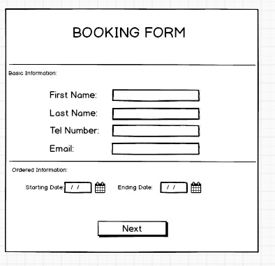

2)booking_Room-2 form

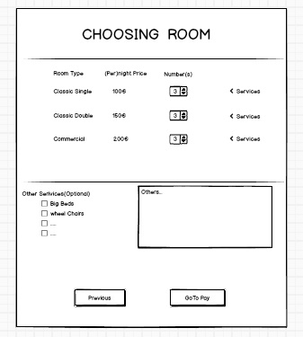

3)Payment page

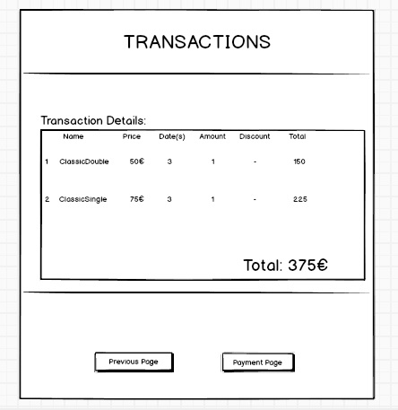

-M&S Management System

1) Home screen M

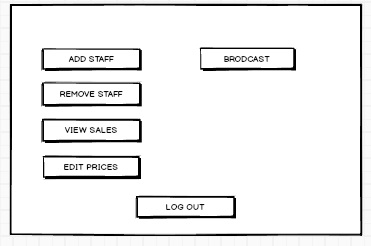

2)Home Screen S

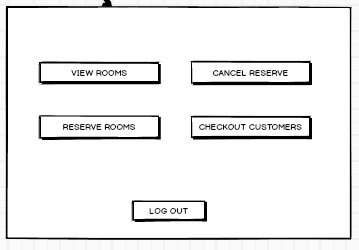

3)Booking Information

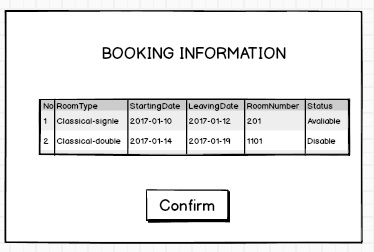

4)CHECK OUT

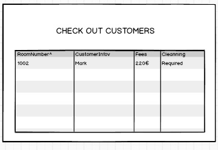

5)CHECK SALES

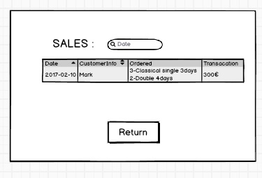

6)Incorrect Log

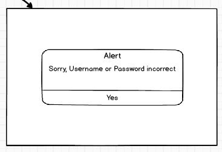

7)key Program

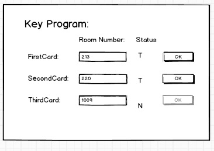

8)Pricing Edit

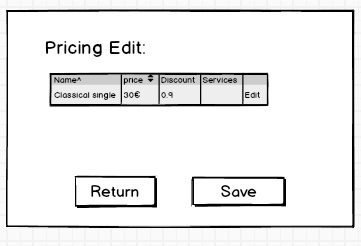

9)RemoveStaff

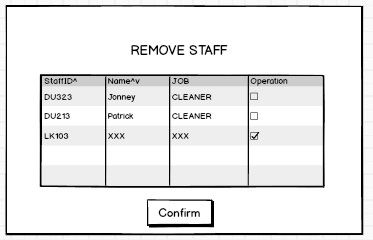

10)Staff Sign-up

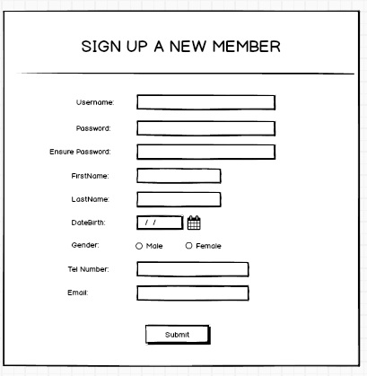

11)ViewRooms

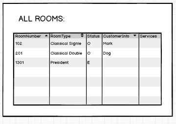

-Customer  Self-Log System

1)CHECK IN

