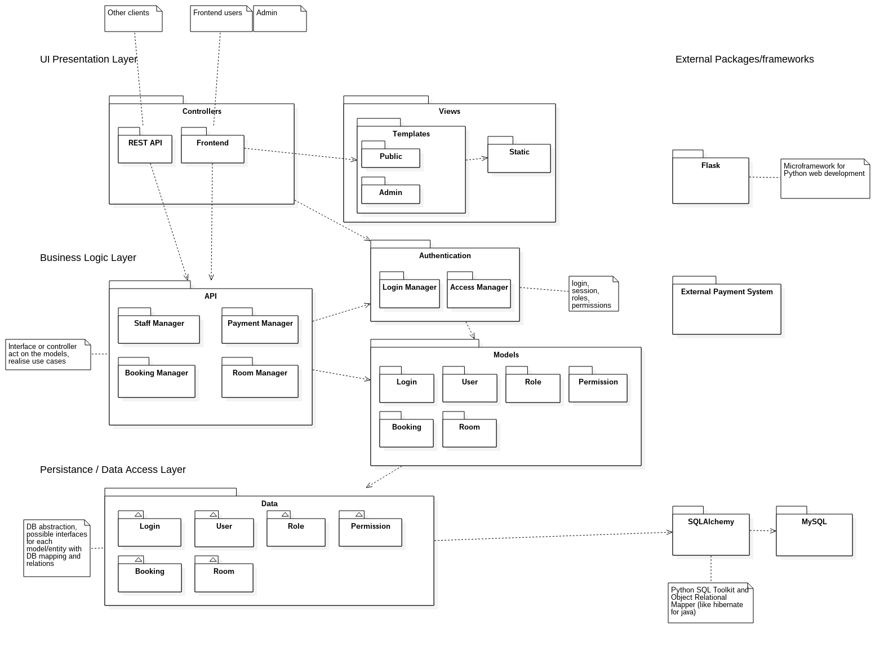

# 7. System Architecture

## Package Diagram

### Architecture
Above is a high level package diagram. The chosen architecture has three tiers; presentation, business logic and data access. The diagram also illustrates that we have decided to implement the Model View Controller architectural pattern. Combined, we should be able to implement highly cohesive modules with appropriate responsibilities.
There are two interfaces to the service; a frontend and a REST API. Both the frontend and the REST API will utilise the same core modules in the business logic layer and should be able to achieve the same functions. The REST API returns data to the client in the JSON format. The frontend controller places the data aquired from the model into a view, which comprises of templates and static content. The generated HTML is then rendered by the clients browser.

<!-- TODO: Discuss business logic layer once we have classes -->

### Implementation Language & Frameworks
The system will be implemented using the Python language. Python supports multiple programming paradigms, including object-oriented style. It emphasizes code readability and has a comprehensive standard library.
As well as the built in features we will leverege the Flask and SQLAlchemy. Flask is a microframework for Python web development. It is ver simple but extremely powerful. Using such a framework will also guide us ensuring that the code remains tidy and follows the Model View Controller architectural pattern. SQLAlchemy is a Python SQL toolkit and object relational mapper. This module will allow us to abstract away trivial SQL queries. This helps with developing clean, decoupled and highly cohesive classes and modules.
These modules shoud together complement and enforce the discussed architectural decisions.
Our use of these frameworks should streamline our work and allow us to achieve better goals in terms of quality, security and functionality as well as maintainability and extensibility.

### Patterns
At an architectural level, we are implementing the Model View Controller architectural pattern. This pattern encourages the separation of responsibility such as the user interface, data representations and the core logic of the service.

The decorator design pattern will be in high usage. This is partly due to the intuitive way in which Python allows it to be used and also our framework relies on it for certain features. The syntax allows us to easily wrap functions/methods. This will provided a simple reusable method to handle user permissions, and more, in a highly decoupled fashion, meaning our core business logic will not contain many non-functional requirements such as security.

<!-- TODO: More? -->

### UML Workbench
Our UML Workbench of choice is StarUML. It is a modern software modelling tool with great features and support for many of the diagrams required throughout the project. It is free for an evaluation period.
